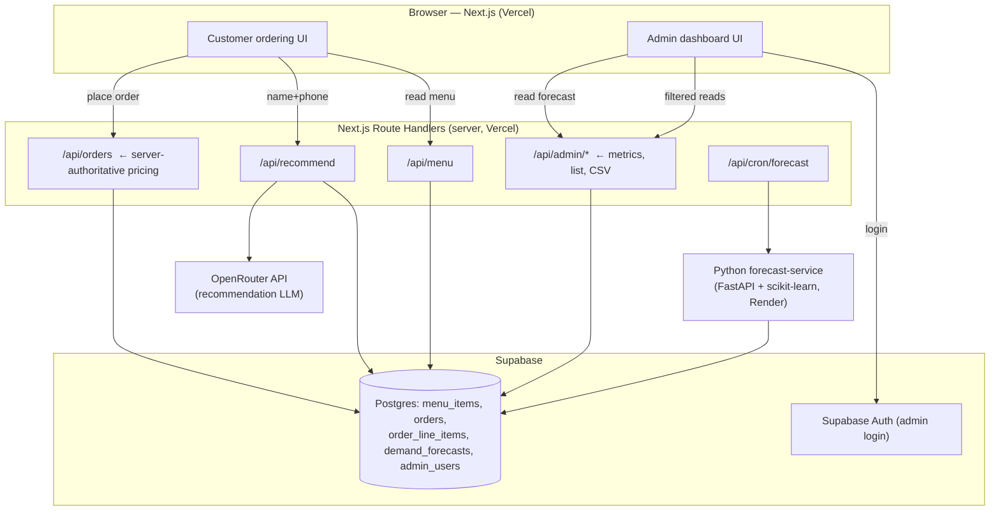
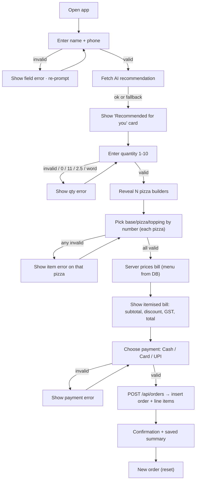
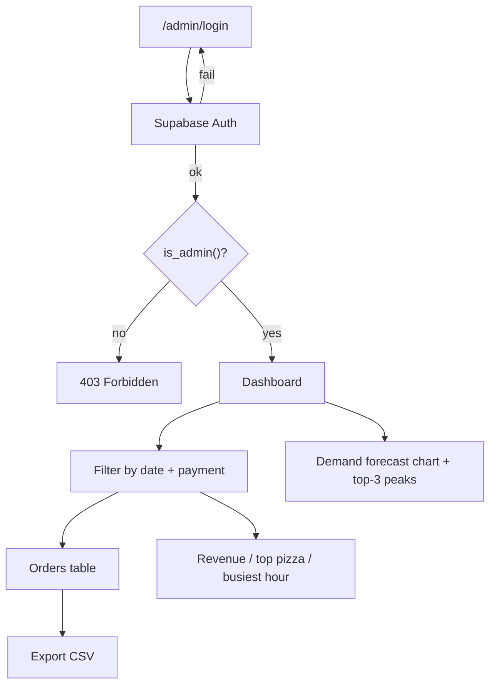

# PizzaFlow — SliceMatic Ordering System
## Stage 3 Product Requirements Document (Full-Stack + Live Demo)

> **Project:** FDE Academy Applied Project · Batch 2487 · PizzaFlow
> **Stage:** 3 of 3 — Full-Stack App + Live Demo (50 pts, +10 bonus)
> **Stack (locked):** Next.js 16 (App Router) on Vercel · Supabase (Postgres + Auth) · OpenRouter · Python/scikit-learn forecasting service
> **AI features (locked):** **A — Recommendation Engine** + **C — Demand Forecasting Dashboard** (two features → targets the +10 bonus)
> **Document type:** Build-grade PRD. A developer who has never seen the brief should be able to build the whole system from this file.

---

## ⚠️ Version Safety Rule (read first)

**Never copy version numbers from this document, from a tutorial, or from memory into `package.json` / `requirements.txt`.** Pins go stale and old pins stay vulnerable.

Before writing or editing any manifest:

1. **Verify latest** for each dependency: `npm show <pkg> version` and a quick search (`"<pkg> npm latest"`, `"<pkg> CVE"`).
2. Align **Node.js** with current **Active LTS** (Next.js 16 requires **Node 20+**; the reference build used Node 22.x LTS).
3. **Next.js specifically:** use a **patched 16.2.x** release. Next 15.x/16.x were downstream-affected by the December 2025 RSC deserialization RCE (React2Shell, `CVE-2025-55182` / `CVE-2025-66478`, CVSS 10.0). Do **not** ship an unpatched 16.0/16.1 build. Run `npm audit` and fix high/critical before the demo.
4. **Use the free tier deliberately.** Free models carry a **`:free` suffix** on the slug (e.g. `meta-llama/llama-4-scout:free`). Calling the **non-suffixed** ID routes as a **paid** request and charges any credits on the account — always include `:free`. Free-tier limits (sources vary and policy changes — verify live on OpenRouter's rate-limit docs): ~**20 requests/min** and on the order of **50–200 requests/day** on a $0 balance (a one-time $10 deposit, which never expires, raises the daily cap — ~1000/day). No credit card needed. Slugs and free availability churn constantly (free models can be pulled without notice) — confirm on `https://openrouter.ai/models` (filter Price → Free) before demo day. Verified live July 3 2026: `meta-llama/llama-4-scout:free` and `meta-llama/llama-3.3-70b-instruct:free` both exist as $0 endpoints; re-check before you submit.

State what you verified in commit messages (e.g. "verified `next@16.2.10`, `npm audit` clean").

---

## Table of Contents

1. [Product Vision](#1-product-vision)
2. [Scope & Rubric Traceability](#2-scope--rubric-traceability)
3. [System Architecture](#3-system-architecture)
4. [Tech Stack](#4-tech-stack)
5. [Repository Structure](#5-repository-structure)
6. [Environment Variables](#6-environment-variables)
7. [Data Model — Supabase Schema](#7-data-model--supabase-schema)
8. [Functional Requirements](#8-functional-requirements)
9. [Pricing Engine — Single Source of Truth](#9-pricing-engine--single-source-of-truth)
10. [Non-Functional Requirements](#10-non-functional-requirements)
11. [API Contract](#11-api-contract)
12. [AI Feature A — Recommendation Engine](#12-ai-feature-a--recommendation-engine)
13. [AI Feature C — Demand Forecasting](#13-ai-feature-c--demand-forecasting)
14. [Admin Dashboard](#14-admin-dashboard)
15. [User Flow Diagrams](#15-user-flow-diagrams)
16. [Frontend Architecture](#16-frontend-architecture)
17. [Security Checklist](#17-security-checklist)
18. [Deployment Runbook](#18-deployment-runbook)
19. [Drawbacks & Limitations](#19-drawbacks--limitations)
20. [Cost vs Value Analysis](#20-cost-vs-value-analysis)
21. [Live Demo Runbook & Q&A Prep](#21-live-demo-runbook--qa-prep)
22. [README Requirements & Submission Checklist](#22-readme-requirements--submission-checklist)
23. [Appendix — Worked Examples & System Prompt](#23-appendix--worked-examples--system-prompt)

---

## 1. Product Vision

SliceMatic's ordering system is a public, responsive web app — it works across both desktop and mobile screen sizes, with neither treated as the primary target — that lets a customer place a pizza order end-to-end — enter their details, build one to ten pizzas from a live menu, see an itemised bill with the correct discount and GST, and choose a payment mode — while every completed order is persisted to a structured database for business analysis. It replaces error-prone phone ordering with a fast digital flow, layers a personalised AI recommendation on top to lift average order value, and gives the owner an authenticated dashboard with revenue, best-sellers, peak-hour analytics, and a 7-day demand forecast to drive staffing and prep decisions. It serves two users: **customers** (18–35, within a ~4 km delivery radius) who want a quick, correct order, and the **owner/manager** who needs trustworthy order data and operational foresight.

---

## 2. Scope & Rubric Traceability

Every Stage 3 rubric line maps to a section of this document. Build to satisfy the right-hand column.

| Rubric component | Pts | Where it's specified |
| --- | --- | --- |
| Vercel frontend — live, responsive, full flow, no crashes | 10 | §8 FRs, §9 Pricing, §16 Frontend, §18 Deployment |
| Supabase DB integration — 3+ tables, orders saved, menu from DB, dashboard | 12 | §7 Schema, §11 API, §14 Admin |
| Auth + admin dashboard — login, filters, revenue, CSV export | 8 | §7 (RLS/`is_admin`), §14 Admin |
| AI feature — OpenRouter, system prompt in README, real UX value | 12 | §12 Feature A, §22 README |
| Live demo + Q&A — runs live, everyone explains their part | 8 | §21 Demo Runbook |
| **★ Bonus — second AI feature, documented** | +10 | §13 Feature C |

**Preserved from Stage 2 (mandatory, unchanged behaviour):** name/phone/quantity/item/payment validation, the 10%-at-≥5 discount, 18% GST on the post-discount total, three payment modes, the itemised bill, and per-order persistence. §8–§10 restate these precisely.

**Out of scope for Stage 3:** real payment settlement, delivery dispatch/tracking, inventory, multi-outlet, customer accounts/passwords.

---

## 3. System Architecture



**Key architectural decisions**

- **Server-authoritative money math.** The browser never computes or submits prices, discount, GST, or total. `/api/orders` re-reads item prices from `menu_items` by code and recomputes the bill server-side. The client sends only *selections* (item codes) + quantity + payment mode. This prevents tampering and makes the "change the discount threshold live" demo a one-line, one-place edit (§9).
- **Two Supabase clients, strict key separation.** The browser uses the **anon** key (public read of the menu only, guarded by RLS). All writes and all admin reads go through **server** route handlers using the **service-role** key, which is never exposed to the client.
- **OpenRouter is called server-side only.** The API key lives in a non-`NEXT_PUBLIC_` env var. The recommendation call happens in `/api/recommend`, never from the browser.
- **Forecasting is a separate Python service** because scikit-learn is Python-only. It reads order history from Supabase, trains, and writes predictions into `demand_forecasts`. The Next.js app just reads that table — no Python at request time.

---

## 4. Tech Stack

> Verify every version live (see Version Safety Rule). The table lists **choices and why**, not authoritative pins.

| Layer | Choice | Notes |
| --- | --- | --- |
| Runtime | Node.js **Active LTS** (20+, 22.x used in reference) | Next 16 requires Node 20+ |
| Framework | **Next.js 16 (App Router)** | Route Handlers for server logic; deploy on Vercel; use patched 16.2.x |
| Language | TypeScript (strict) | No `any` without a commented reason |
| UI | React 19.2 + Tailwind CSS **v4** | Responsive (desktop + mobile); design-system tokens via `@theme` (§16.2) |
| Icons | **lucide-react** | Line icons only — no emoji (§16.2) |
| Fonts | **`next/font`** (Inter + JetBrains Mono) | Loaded via `next/font`; no layout shift (§16.2) |
| Forms/validation | React Hook Form + **Zod** | Same rules mirrored server-side |
| DB | **Supabase Postgres** | 5 tables (§7); RLS enabled |
| Auth | **Supabase Auth** (email/password) | Admin-only; `is_admin()` gate |
| DB access | `@supabase/supabase-js` | anon (browser read) + service-role (server) |
| Charts | Recharts (or Chart.js) | Forecast + dashboard visuals |
| AI gateway | **OpenRouter** (OpenAI-compatible) | `response_format: json_schema`; server-side key |
| Recommend model | **`meta-llama/llama-4-scout:free`** (fallback `meta-llama/llama-3.3-70b-instruct:free`) | **Free tier** (`:free` = $0, verified live 3 Jul 2026); fast, low latency; JSON via defensive parsing — **re-verify slug before submit** |
| Forecast | **Python + scikit-learn** (`RandomForestRegressor`, `LinearRegression` baseline) | FastAPI service |
| Deploy: frontend | **Vercel** | Public URL; env vars in dashboard |
| Deploy: forecast svc | Render / Railway (free tier) | Or Vercel Python function |
| Deploy: DB/Auth | Supabase (free tier) | Read-only project access shared with grader |
| Cron | Vercel Cron → `/api/cron/forecast` | Daily retrain; guarded by `CRON_SECRET` |

---

## 5. Repository Structure

Single monorepo, meaningful commits from all members across all three weeks (Rule 2 — a single final-day upload scores zero on version control).

```
slicematic/
├── web/                                # Next.js 16 App Router → Vercel
│   ├── app/
│   │   ├── page.tsx                    # customer ordering flow (stepper)
│   │   ├── layout.tsx
│   │   ├── admin/
│   │   │   ├── login/page.tsx          # Supabase Auth login
│   │   │   └── page.tsx                # dashboard (protected)
│   │   └── api/
│   │       ├── menu/route.ts           # GET  live menu
│   │       ├── recommend/route.ts      # POST AI recommendation (Feature A)
│   │       ├── orders/route.ts         # POST create order (server pricing)
│   │       ├── admin/orders/route.ts   # GET  filtered orders
│   │       ├── admin/metrics/route.ts  # GET  revenue / top pizza / busiest hour
│   │       ├── admin/export/route.ts   # GET  CSV export
│   │       ├── admin/forecast/route.ts # GET  latest forecast
│   │       ├── cron/forecast/route.ts  # POST trigger retrain (cron only)
│   │       ├── health/route.ts         # GET  liveness probe (no DB call)
│   │       └── ready/route.ts          # GET  readiness probe (Supabase reachable)
│   ├── lib/
│   │   ├── env.ts                      # Zod-validated env — crash on bad config
│   │   ├── pricing.ts                  # ★ SINGLE SOURCE OF TRUTH: constants + engine
│   │   ├── validation.ts               # name/phone/qty/choice/payment (ported)
│   │   ├── response.ts                 # standard success/error/paginated envelope + error codes
│   │   ├── ratelimit.ts                # per-IP limiter (durable store; serverless-safe)
│   │   ├── csv.ts                       # CSV export with injection guard
│   │   ├── openrouter.ts               # chat-completion wrapper
│   │   └── supabase/
│   │       ├── browser.ts              # anon client (menu read only)
│   │       ├── server.ts               # service-role client (server only)
│   │       └── admin.ts                # auth-scoped client for admin session
│   ├── components/                     # Stepper, MenuList, BillTable, RecommendCard, admin widgets
│   ├── .env.example
│   ├── package.json
│   └── tsconfig.json
├── forecast-service/                   # Python → Render
│   ├── app.py                          # FastAPI: POST /train, GET /forecast
│   ├── model.py                        # feature build + train + RMSE + predict
│   ├── requirements.txt
│   └── .env.example
├── supabase/
│   ├── migrations/
│   │   ├── 0001_schema.sql             # tables + enums + indexes
│   │   ├── 0002_rls.sql                # RLS policies + is_admin()
│   │   └── 0003_views.sql              # metrics helpers (optional RPC/views)
│   └── seed/
│       ├── seed_menu.py                # loads Types_of_*.txt → menu_items (swap-safe)
│       └── seed_orders.py              # synthetic history so the forecast has signal
├── .github/
│   └── workflows/
│       └── ci.yml                      # npm ci → typecheck → lint → npm audit (every PR)
├── docs/
│   └── PizzaFlow_Stage3_PRD.md         # this file
├── README.md                           # architecture, setup, AI docs, system prompts, model choice
├── .gitignore
└── .cursorignore                       # mirrors .gitignore — keeps .env/keys out of AI indexing
```

**`.gitignore` must exclude:** `.env`, `.env.*` (keep `!.env.example`), `node_modules/`, `.next/`, `dist/`, `__pycache__/`, `*.log`, `*.pem`, `*.key`. Verify `git status` never lists `.env` before first push. Commit a **`.cursorignore`** mirroring the same secret paths (`.env*`, `*.pem`, `*.key`, `node_modules/`, `.next/`) so keys never enter AI-assistant indexing — and never paste real `.env` values into an AI chat; describe the *shape* of config instead.

---

## 6. Environment Variables

**`web/.env.example`**

```env
# ── Supabase ────────────────────────────────────────────────
NEXT_PUBLIC_SUPABASE_URL=https://<project-ref>.supabase.co
NEXT_PUBLIC_SUPABASE_ANON_KEY=<anon-key>          # safe in browser (RLS-guarded)
SUPABASE_SERVICE_ROLE_KEY=<service-role-key>      # SERVER ONLY — never NEXT_PUBLIC

# ── OpenRouter (Feature A) ──────────────────────────────────
OPENROUTER_API_KEY=<key>                          # SERVER ONLY
OPENROUTER_MODEL=meta-llama/llama-4-scout:free    # :free = $0 — verify slug on openrouter.ai/models
OPENROUTER_FALLBACK_MODEL=meta-llama/llama-3.3-70b-instruct:free  # rotate here on 429 / timeout

# ── Forecast service (Feature C) ────────────────────────────
FORECAST_SERVICE_URL=https://<render-app>.onrender.com
FORECAST_SERVICE_TOKEN=<shared-secret>            # svc auth

# ── Cron ────────────────────────────────────────────────────
CRON_SECRET=<random-hex>                          # guards /api/cron/forecast

# ── App ─────────────────────────────────────────────────────
NEXT_PUBLIC_APP_URL=http://localhost:3000
```

**`forecast-service/.env.example`**

```env
SUPABASE_URL=https://<project-ref>.supabase.co
SUPABASE_SERVICE_ROLE_KEY=<service-role-key>
FORECAST_SERVICE_TOKEN=<shared-secret>
MODEL_VERSION=rf-v1
```

**Rule:** only `NEXT_PUBLIC_*` vars reach the browser. The service-role key and OpenRouter key must **never** carry that prefix. Validate all env at boot with Zod (`web/lib/env.ts`) and `process.exit(1)` on failure so the app never runs misconfigured.

---

## 7. Data Model — Supabase Schema

Five tables (brief requires 3+): `menu_items`, `orders`, `order_line_items`, plus `demand_forecasts` (Feature C) and `admin_users` (auth gate). Money is stored as **integer paise**, never floats.

### 7.1 Design decisions (be ready to justify these live)

- **Paise (integer), not rupees (float).** All money columns are `_paise integer`. Floating-point rupees accumulate rounding error; integers are exact. The engine formats to `₹X.XX` only at display. (This also matches the e-commerce best practice of storing the smallest currency unit.)
- **One `menu_items` table with a `category` enum**, not three tables. A single menu table is normalised, swap-resilient, and trivially extended (add a category without a migration to a new table). The three Stage 2 files map to `category ∈ {base, pizza, topping}`.
- **Snapshot columns on `order_line_items`.** Each line stores both a FK to `menu_items` **and** a copy of the name + price at order time. If the grader swaps the menu or a price changes, historical orders keep the exact prices the customer paid — the same reason Stage 2 embedded `ID:Name:Price` in the log. FKs give referential integrity for analytics; snapshots give historical truth.
- **RLS on everything.** Public can read the available menu; only the server (service-role) writes orders; only admins read orders/metrics/forecasts.

### 7.2 `0001_schema.sql`

```sql
create extension if not exists pgcrypto;              -- gen_random_uuid()

create type menu_category as enum ('base', 'pizza', 'topping');
create type payment_mode  as enum ('Cash', 'Card', 'UPI');

-- MENU ---------------------------------------------------------------
create table menu_items (
  id           uuid primary key default gen_random_uuid(),
  code         text not null,                          -- original file ID: 'B1','P3','T7'
  name         text not null,
  category     menu_category not null,
  price_paise  integer not null check (price_paise > 0),
  is_available boolean not null default true,
  sort_order   integer not null default 0,
  created_at   timestamptz not null default now(),
  unique (category, code)
);
create index idx_menu_category on menu_items (category) where is_available;

-- ORDERS -------------------------------------------------------------
create table orders (
  id                 uuid primary key default gen_random_uuid(),
  customer_name      text not null check (char_length(customer_name) between 2 and 40),
  customer_phone     text not null check (customer_phone ~ '^[6-9][0-9]{9}$'),
  session_started_at timestamptz,
  placed_at          timestamptz not null default now(),
  quantity           integer not null check (quantity between 1 and 10),
  subtotal_paise     integer not null check (subtotal_paise >= 0),
  discount_paise     integer not null default 0 check (discount_paise >= 0),
  discount_applied   boolean not null default false,
  gst_paise          integer not null check (gst_paise >= 0),
  total_paise        integer not null check (total_paise >= 0),
  payment_mode       payment_mode not null,
  created_at         timestamptz not null default now()
);
create index idx_orders_placed_at    on orders (placed_at);
create index idx_orders_payment_mode on orders (payment_mode);

-- ORDER LINE ITEMS (one row per pizza) --------------------------------
create table order_line_items (
  id                uuid primary key default gen_random_uuid(),
  order_id          uuid not null references orders(id) on delete cascade,
  line_no           integer not null check (line_no >= 1),
  base_item_id      uuid references menu_items(id) on delete set null,
  pizza_item_id     uuid references menu_items(id) on delete set null,
  topping_item_id   uuid references menu_items(id) on delete set null,
  base_name         text not null,                     -- snapshots
  pizza_name        text not null,
  topping_name      text not null,
  base_price_paise    integer not null,
  pizza_price_paise   integer not null,
  topping_price_paise integer not null,
  unit_price_paise  integer not null,
  unique (order_id, line_no)
);
create index idx_oli_order on order_line_items (order_id);
create index idx_oli_pizza on order_line_items (pizza_item_id);

-- DEMAND FORECASTS (Feature C output) --------------------------------
create table demand_forecasts (
  id             uuid primary key default gen_random_uuid(),
  generated_at   timestamptz not null default now(),
  target_date    date not null,
  hour_of_day    smallint not null check (hour_of_day between 0 and 23),
  predicted_orders numeric(6,2) not null,
  model_version  text not null,
  rmse           numeric(8,3),
  unique (generated_at, target_date, hour_of_day)
);
create index idx_forecast_lookup on demand_forecasts (target_date, hour_of_day);

-- ADMIN ALLOWLIST ----------------------------------------------------
create table admin_users (
  user_id    uuid primary key references auth.users(id) on delete cascade,
  email      text not null,
  created_at timestamptz not null default now()
);
```

### 7.3 `0002_rls.sql`

```sql
create or replace function is_admin() returns boolean
  language sql stable security definer set search_path = public as $$
    select exists (select 1 from admin_users where user_id = auth.uid());
$$;

alter table menu_items       enable row level security;
alter table orders           enable row level security;
alter table order_line_items enable row level security;
alter table demand_forecasts enable row level security;
alter table admin_users      enable row level security;

-- Menu: anyone may read available items; only admins may modify.
create policy menu_public_read on menu_items
  for select using (is_available or is_admin());
create policy menu_admin_write on menu_items
  for all using (is_admin()) with check (is_admin());

-- Orders + line items: admins read; writes come from service-role (bypasses RLS).
create policy orders_admin_read on orders
  for select using (is_admin());
create policy oli_admin_read on order_line_items
  for select using (is_admin());

-- Forecasts: admins read.
create policy forecast_admin_read on demand_forecasts
  for select using (is_admin());

-- Admin allowlist: a user may read only their own row.
create policy admin_self_read on admin_users
  for select using (user_id = auth.uid());
```

> **Note:** the service-role key bypasses RLS, so order creation from `/api/orders` and forecast writes from the cron path work without a permissive insert policy. Never ship the service-role key to the browser.

### 7.4 Seeding (`supabase/seed/`)

- **`seed_menu.py`** parses `Types_of_Base.txt`, `Types_of_Pizza.txt`, `Types_of_Toppings.txt` using the **same defensive rules as Stage 2** (strip whitespace, split on `;`, skip blank/malformed/non-numeric/non-positive lines, tolerate a UTF-8 BOM) and upserts into `menu_items` keyed on `(category, code)`. Because the loader is swap-safe, re-running it against the grader's replacement files re-seeds cleanly. Prices convert rupees → paise (`×100`).
- **`seed_orders.py`** generates ~60–90 days of synthetic historical orders so Feature C has signal on day one (a fresh outlet has no history — see §13 cold-start). The generator follows the SliceMatic economics baseline: ~38 weekday / ~68 weekend orders per day, a lunch bump (12–14h) and a strong dinner peak (19–22h), realistic name/phone/menu selections. **Clearly label synthetic rows** (e.g. a recognisable phone prefix) so they can be excluded from revenue if needed.

---

## 8. Functional Requirements

All Stage 2 behaviour is preserved exactly. IDs let the demo/README cross-reference.

### 8.1 Customer intake
- **FR-1 Name.** Letters and spaces only, 2–40 chars, at least one letter, trimmed. Reject digits/symbols, all-spaces, empty. Error: *"Name must be 2–40 letters (spaces allowed), no numbers or symbols."*
- **FR-2 Phone.** Exactly 10 digits, must start with 6/7/8/9. Reject wrong length, non-digits, leading 0–5. Error: *"Phone must be exactly 10 digits and start with 6, 7, 8, or 9."*
- **FR-3 Session timestamp.** Record `session_started_at` when the flow begins; persist with the order.

### 8.2 AI recommendation (Feature A) — after intake, before menu
- **FR-4.** Immediately after FR-1/FR-2 pass, call `/api/recommend` with the phone. Show a "Recommended for you" card (pizza + topping + one-line reason) before the menu step. It is a **suggestion only** — the customer may accept (prefill) or ignore. Ordering must never block on it (§12 fallback).

### 8.3 Quantity
- **FR-5.** Accept integers 1–10 only. Reject 0, negatives, >10, floats (`2.5`), words (`three`), empty. Error for range: *"Quantity must be a whole number between 1 and 10."*; for cap: *"Maximum 10 pizzas per order."*
- **FR-6.** Reveal exactly *quantity* pizza-builder rows.

### 8.4 Menu selection (from DB)
- **FR-7.** Load bases/pizzas/toppings from `menu_items` via `/api/menu` (not text files). Display each category as a numbered list with names and `₹` prices.
- **FR-8.** Each pizza = exactly one base + one pizza + one topping, selected **by item number**. Reject out-of-range numbers, 0, letters, empty, and a price typed instead of an index. Error: *"Enter the item NUMBER from the list (1–N)."*
- **FR-9.** If the menu can't load (empty/unavailable), show a clear error and disable ordering — never crash.

### 8.5 Bill
- **FR-10.** Render an itemised bill (see §9): per pizza show Base/Pizza/Topping with prices and a line subtotal; then order subtotal, discount line (10% if applied), GST 18% on the post-discount total, and the bold final total. Right-aligned `₹`, aligned columns, in a table component (not a plain textbox).

### 8.6 Payment
- **FR-11.** Offer exactly three modes: 1 Cash, 2 Card, 3 UPI. Reject anything else (*"Choose payment: 1 = Cash, 2 = Card, 3 = UPI."*). Show a mode-specific confirmation (Cash → pay rider; Card → payment confirmed; UPI → collect request sent).

### 8.7 Persistence
- **FR-12.** On confirmation, insert one `orders` row + one `order_line_items` row per pizza, atomically, via `/api/orders`. Persist: timestamp, session start, name, phone, per-pizza selections + unit prices (with snapshots), quantity, subtotal, discount, discount_applied, GST, total, payment mode. Confirmation screen echoes the saved order.

### 8.8 Admin (see §14)
- **FR-13.** Admin login (Supabase Auth). **FR-14.** Orders list with date-range + payment-mode filters. **FR-15.** Total revenue (respects filters). **FR-16.** Top-selling pizza. **FR-17.** Busiest hour of day (IST). **FR-18.** CSV export of the filtered set.

### 8.9 Forecasting (Feature C, see §13)
- **FR-19.** Nightly job trains on order history and writes next-7-day hourly predictions to `demand_forecasts`. **FR-20.** Dashboard shows the forecast chart + top-3 predicted peak hours, and documents the model + RMSE.

---

## 9. Pricing Engine — Single Source of Truth

`web/lib/pricing.ts` owns **all** money logic and constants. Nothing else may hardcode a rate or threshold. This is what you edit during the live "change the discount threshold from 5 to 3" test — one constant, one file.

```ts
// web/lib/pricing.ts  — the ONLY place these live.
export const MIN_QTY = 1;
export const MAX_QTY = 10;
export const DISCOUNT_THRESHOLD = 5;   // ← live-demo edit point (change to 3)
export const DISCOUNT_RATE = 0.10;     // 10%
export const GST_RATE = 0.18;          // 18%

export type Selected = { base: MenuItem; pizza: MenuItem; topping: MenuItem };

const round = (n: number) => Math.round(n);   // half-up, integer paise

export function computeBill(pizzas: Selected[]) {
  const lineItems = pizzas.map((p) => ({
    ...p,
    unitPricePaise: p.base.pricePaise + p.pizza.pricePaise + p.topping.pricePaise,
  }));
  const quantity = lineItems.length;
  const subtotalPaise = lineItems.reduce((s, li) => s + li.unitPricePaise, 0);
  const discountApplied = quantity >= DISCOUNT_THRESHOLD;
  const discountPaise = discountApplied ? round(subtotalPaise * DISCOUNT_RATE) : 0;
  const postDiscountPaise = subtotalPaise - discountPaise;
  const gstPaise = round(postDiscountPaise * GST_RATE);
  const totalPaise = postDiscountPaise + gstPaise;
  return { lineItems, quantity, subtotalPaise, discountApplied,
           discountPaise, postDiscountPaise, gstPaise, totalPaise };
}

export const rupees = (paise: number) => `₹${(paise / 100).toFixed(2)}`;
```

**Order of operations (fixed):** unit = base + pizza + topping → subtotal = Σ units → discount = 10% of subtotal **iff** qty ≥ threshold → post-discount = subtotal − discount → **GST = 18% of post-discount** → total = post-discount + GST. Round at each money step to integer paise.

**Server-authoritative:** `/api/orders` ignores any prices sent by the client. It looks up each selected `code` in `menu_items`, builds `Selected[]` from DB prices, calls `computeBill`, and persists that result. The identical constants are used to render the preview bill, so client and server always agree.

**Verification (matches the SliceMatic sample bill):** Cheese Burst ₹229 + BBQ Chicken ₹379 + Extra Cheese ₹69 = ₹677/pizza; ×5 → subtotal ₹3385.00; discount ₹338.50; post ₹3046.50; GST ₹548.37; **total ₹3594.87.** In paise: 338500 → −33850 → 304650 → +54837 → **359487.** ✔ (full trace in §23).

---

## 10. Non-Functional Requirements

### 10.1 Validation rules (mirrored client + server)

| Field | Rule | Rejects |
| --- | --- | --- |
| Name | `^[A-Za-z ]+$`, len 2–40, ≥1 letter, trimmed | digits, symbols, all-spaces, empty |
| Phone | `^[6-9][0-9]{9}$` | wrong length, non-digit, leading 1–5 |
| Quantity | integer, 1–10 | 0, 11+, negatives, `2.5`, `three`, empty |
| Item choice | integer, 1–N (per category) | 0, >N, letters, empty, a price value |
| Payment | one of {1,2,3} | anything else |

Zod schemas in `web/lib/validation.ts` are the source; forms use them via React Hook Form; route handlers re-validate the same schemas (never trust the client).

### 10.2 The 8 Stage 2 edge cases — all handled without an unhandled exception

| # | Case | Handling |
| --- | --- | --- |
| 1 | Name only spaces | trim → empty → FR-1 error |
| 2 | 10 digits starting with 1 | FR-2 error |
| 3 | Quantity 0 / 11 | FR-5 range / cap error |
| 4 | Item choice 0 / > length | FR-8 range error |
| 5 | Price typed as item number | out-of-range → FR-8 error |
| 6 | Empty input anywhere | field-specific error, stay on step |
| 7 | Non-integer quantity (`three`, `2.5`) | FR-5 error |
| 8 | Menu row missing a price field | defensive parser skips it; if a category ends up empty → FR-9 |

### 10.3 Other NFRs
- **No unhandled exceptions.** Route handlers wrap logic in try/catch and return the standard error envelope (§11); the UI shows inline errors and never white-screens (root Error Boundary).
- **Performance.** First interaction < 2.5 s on a standard broadband connection. Menu cached. Dashboard queries indexed. Recommendation call has a **timeout** (e.g. 4 s) → fall back rather than stall ordering.
- **Data format.** Money as integer paise in DB; `₹X.XX` in UI; timestamps `timestamptz` (UTC in DB, rendered IST). CSV is RFC-4180 with an injection guard (§17).
- **Responsive & accessible.** Labelled inputs; visible focus; colour-contrast AA; errors announced via `aria-live`.
- **Idempotency/atomicity.** Order + all its line items commit together; a failure rolls back so no partial orders.

---

## 11. API Contract

All Route Handlers speak one contract: a single response envelope, a fixed error-code set, per-IP rate limiting, and per-endpoint documentation to a shared template. Errors never leak stack traces.

### 11.1 Response envelope

Every handler returns exactly one of these shapes via `NextResponse.json(payload, { status })`. Helpers live in `lib/response.ts` so the shape is defined once and reused everywhere.

```jsonc
// success
{ "success": true, "data": { /* ... */ } }

// error
{ "success": false, "error": {
    "code": "VALIDATION_ERROR",
    "message": "Human-readable",                    // safe to show the user; never a stack trace
    "fields": { "phone": ["Phone must be exactly 10 digits..."] }  // only on VALIDATION_ERROR
} }

// paginated success (admin lists that can grow — orders)
{ "success": true, "data": [ /* ... */ ],
  "pagination": { "total": 240, "page": 1, "limit": 50, "totalPages": 5 } }
```

### 11.2 Error codes

The PRD is the source of truth for code names — do **not** rename them to match any external blueprint. Each maps to one HTTP status; `fields` appears only on `VALIDATION_ERROR`.

| HTTP | Code | When to use |
| --- | --- | --- |
| 400 | `VALIDATION_ERROR` | Zod validation failed on body/query/params (carries `fields`) |
| 401 | `UNAUTHENTICATED` | No/invalid Supabase session on an admin route, or bad cron secret |
| 403 | `FORBIDDEN` | Authenticated but not an admin (`is_admin()` false) |
| 409 | `CONFLICT` | Duplicate/replayed write (idempotency guard on `POST /api/orders`) |
| 422 | `MENU_ITEM_NOT_FOUND` | A submitted item `code` isn't in `menu_items` / is unavailable |
| 429 | `RATE_LIMITED` | Per-IP rate limit exceeded (§11.5) |
| 200 / 503 | `AI_UNAVAILABLE` | Recommendation model failed — 200 with the deterministic fallback pick, or 503 if surfaced |
| 500 | `INTERNAL` | Unhandled server error — generic message only; details logged server-side |

### 11.3 Endpoint summary

| Method & path | Auth | Body / query | Returns |
| --- | --- | --- | --- |
| `GET /api/menu` | public | — | `{ bases[], pizzas[], toppings[] }` (id, code, name, pricePaise) |
| `POST /api/recommend` | public | `{ phone }` | `{ recommendation: { pizzaCode, toppingCode, pizzaName, toppingName, reason } }` |
| `POST /api/orders` | public | `{ name, phone, sessionStartedAt, paymentMode, lineItems:[{baseCode,pizzaCode,toppingCode}] }` | `{ order, bill }` — **priced server-side** |
| `GET /api/admin/orders` | admin | `?from&to&payment&page&limit` | `{ orders[] }` + `pagination` (with line items) |
| `GET /api/admin/metrics` | admin | `?from&to` | `{ revenuePaise, topPizza, busiestHour, orderCount }` |
| `GET /api/admin/export` | admin | `?from&to&payment` | `text/csv` (Content-Disposition attachment) |
| `GET /api/admin/forecast` | admin | — | `{ generatedAt, model, rmse, points[], top3PeakHours[] }` |
| `POST /api/cron/forecast` | cron secret | header `x-cron-secret` | triggers forecast-service retrain |
| `GET /api/health` | public | — | `{ status: "ok" }` — liveness, no DB call |
| `GET /api/ready` | public | — | `200 { ready: true }` if Supabase reachable, else `503` |

### 11.4 Per-endpoint documentation standard

Every route above is documented in the README (and/or `docs/`) to this template, so a grader can read the contract without opening the code:

```
### METHOD /api/<path>
Description:   one sentence.
Auth:         public | admin (Supabase session + is_admin()) | cron secret
Request:      headers · query params · JSON body (each field: required?, type, note)
Responses:    200/201 success envelope (shape of data)
              400 VALIDATION_ERROR (fields) · 401 UNAUTHENTICATED · 403 FORBIDDEN
              409 CONFLICT · 422 MENU_ITEM_NOT_FOUND · 429 RATE_LIMITED · 500 INTERNAL  (as applicable)
Business rules: e.g. pricing is server-authoritative (§9); client prices ignored.
Example:      curl / fetch with a sample body and the returned envelope.
```

Worked example — `POST /api/orders`:

```
Description:  Create an order; server recomputes the bill from DB prices and persists it.
Auth:         public (per-IP rate limited)
Request body: { name, phone, sessionStartedAt, paymentMode: 'Cash'|'Card'|'UPI',
                lineItems: [{ baseCode, pizzaCode, toppingCode }] }   // 1–10 items
Responses:    200 { order, bill }              — bill priced server-side (§9)
              400 VALIDATION_ERROR (fields)    — bad name/phone/qty/payment
              422 MENU_ITEM_NOT_FOUND          — a code not in menu_items
              409 CONFLICT                     — replayed submission (idempotency)
              429 RATE_LIMITED                 — too many creates from one IP
              500 INTERNAL                     — unhandled (order rolled back atomically, §10.3)
Business rules: client-sent prices are ignored; computeBill() is the only pricer;
                the order and all its line items commit atomically or not at all.
```

### 11.5 Rate limiting, request limits, auth & health

- **Rate limiting (per IP).** Serverless functions share no in-process memory, so back the limiter with a durable store **inside the existing stack** — a Supabase Postgres counter table (or an edge KV) via `lib/ratelimit.ts`, not an in-memory counter. Baseline: **~100 requests / 60 s** general, and a **tighter ~10 / 60 s** on the abuse- and LLM-cost-sensitive `POST /api/orders` and `POST /api/recommend`. On exceed, return **`RATE_LIMITED` (429)**.
- **Request-body cap.** Reject bodies larger than **~10 kB** (the order payload is tiny) with `VALIDATION_ERROR` — a cheap guard against payload-flood abuse.
- **Admin auth is Supabase-managed.** Admin routes require a valid **Supabase Auth** session **and** `is_admin()`. Password hashing (bcrypt), the access/refresh JWTs, token rotation, and the secure session cookie are all handled by **Supabase Auth** — none of it is hand-rolled here. Missing/invalid session → `UNAUTHENTICATED` (401); authenticated non-admin → `FORBIDDEN` (403).
- **Cron auth.** `POST /api/cron/forecast` requires the `x-cron-secret` header to equal `CRON_SECRET` (constant-time compare); otherwise `UNAUTHENTICATED` (401).
- **Health / readiness.** `GET /api/health` returns 200 without touching the DB (liveness); `GET /api/ready` runs a light Supabase check and returns 503 when unavailable (readiness). Both are exempt from the strict rate limits.

---

## 12. AI Feature A — Recommendation Engine

**Goal:** after the customer identifies themselves, suggest one pizza + one topping tailored to their past orders, with a one-line reason, to lift AOV and speed selection. **UX value:** returning customers get a relevant nudge; new customers get a popular pick; the flow is faster because the suggestion prefills the builder.

### 12.1 Flow
1. Intake passes → `POST /api/recommend { phone }`.
2. Server queries prior orders for that phone (join `order_line_items` → names, most recent ~10 orders), building a compact history summary.
3. Server calls OpenRouter with a **documented system prompt** (§23) + the **current available menu** + the **history**, requesting **structured JSON** (`response_format: json_schema`).
4. Server **validates** the returned `pizzaCode`/`toppingCode` against the live menu. If valid → return it; the UI shows the card and offers "Use this".
5. **Cold start / failure fallback:** if no history, or the model errors/times out/returns an invalid code, return a deterministic "most popular / house favourite" pick (computed from `order_line_items` counts, or a configured default) with a generic reason. **Ordering is never blocked.**

### 12.2 Model choice (document in README)
Primary `meta-llama/llama-4-scout:free`, fallback `meta-llama/llama-3.3-70b-instruct:free` — both on OpenRouter's **free tier** (`:free` suffix → $0 per call; both verified as live $0 endpoints on 3 Jul 2026). Scout is chosen for **low latency** (a light MoE model, real-time-friendly — it's on the critical ordering path and shown live); the 70B is a reliable heavier fallback when Scout is throttled. **Zero cost**: no credit card, and ~20 req/min with ~50–200 req/day on a $0 balance is far more than a demo needs. **The `:free` suffix is mandatory** — the non-suffixed slug bills credits (paid Scout is ~$0.08/$0.30 per M tokens). **Re-verify both slugs on `openrouter.ai/models` (filter Price → Free) before you submit** — the free roster rotates weekly and models can be pulled without notice. OpenRouter is OpenAI-compatible: `POST https://openrouter.ai/api/v1/chat/completions`. (Simplest zero-config backup if a slug disappears: the `openrouter/free` auto-router, which picks a free model supporting the features you request — but it's non-deterministic, so log the model actually used.)

### 12.3 Guardrails
- Server-side key only; never called from the browser.
- **Request** JSON output, but **don't assume strict `json_schema` support** — free models are inconsistent here. Parse defensively (extract the JSON object, tolerate stray text) rather than trusting a schema-constrained response.
- Menu-validate every recommended code (the model must not invent items).
- 4 s timeout + **429/failure rotation to the fallback `:free` model** + graceful fallback to a deterministic popular pick; per-IP rate limit; log the model actually used + latency for the demo.
- Optional upsell tuning: the prompt may prefer higher-margin toppings, but must still respect stated preferences.

---

## 13. AI Feature C — Demand Forecasting

**Goal:** predict order volume by hour and day so the owner can staff riders, schedule the chef, and pre-prep dough for peaks. Surfaced on the admin dashboard with a chart + the **top 3 predicted peak hours** for the next 7 days. **This is the bonus feature.**

### 13.1 Pipeline (`forecast-service/`, Python + scikit-learn)
1. **Extract:** read `orders.placed_at` from Supabase (service role).
2. **Aggregate:** count orders per `(date, hour)` bucket (0 for empty hours within operating hours 11:00–23:00 IST).
3. **Features:** `hour_of_day`, `day_of_week` (0–6), `is_weekend`, and lag features (same hour previous day / previous week). Target: order count for that bucket.
4. **Model:** `RandomForestRegressor` — captures the non-linear interaction between hour and weekday (weekend dinner ≠ weekday dinner) and is robust to outliers, out-performing a linear fit on this shape. Keep a `LinearRegression` **baseline** to report the improvement.
5. **Evaluate:** temporal train/test split (last ~20% of dates as test — never random, to avoid leakage). Report **RMSE** (orders/hour) for both models; store the chosen model's RMSE with each forecast row.
6. **Predict:** next 7 days × operating hours → upsert into `demand_forecasts` (`target_date`, `hour_of_day`, `predicted_orders`, `model_version`, `rmse`).

### 13.2 Serving & scheduling
- FastAPI: `POST /train` (retrain + write forecasts, guarded by `FORECAST_SERVICE_TOKEN`), `GET /forecast` (latest, optional).
- **Vercel Cron** hits `POST /api/cron/forecast` daily (guarded by `CRON_SECRET`), which calls the service. The dashboard reads `demand_forecasts` via `/api/admin/forecast` — **no Python at request time.**
- Deploy the service on Render/Railway free tier (or a Vercel Python serverless function). Note free-tier cold starts — warm it before the demo.

### 13.3 Cold start (be honest about this)
A brand-new outlet has no history, so the model can't learn real patterns. For the demo, `seed_orders.py` provides synthetic history matching the SliceMatic demand curve (§7.4). Document clearly that production accuracy requires several weeks of real orders and that early forecasts are indicative, not precise.

---

## 14. Admin Dashboard

**Auth:** `/admin/login` uses Supabase Auth (email/password). After login, the server checks `is_admin()`; non-admins get 403. Seed at least one row in `admin_users` for the grader account.

**Widgets (all respect the date-range + payment filters where relevant):**

| Widget | Source |
| --- | --- |
| Orders table + filters (date range, payment mode) | `GET /api/admin/orders?from&to&payment` |
| Total revenue | `sum(total_paise)` over filtered orders → `₹` |
| Top-selling pizza | count `order_line_items.pizza_name` (one row = one pizza), desc, limit 1 |
| Busiest hour of day | group by `extract(hour from placed_at at time zone 'Asia/Kolkata')`, desc, limit 1 |
| CSV export | `GET /api/admin/export` — filtered set, injection-guarded |
| Demand forecast (Feature C) | `GET /api/admin/forecast` → chart + top-3 peak hours |

**Reference metric queries** (implement as route-handler queries or Postgres RPC/views — either is fine, but be ready to explain one):

```sql
-- Busiest hour (IST)
select extract(hour from placed_at at time zone 'Asia/Kolkata')::int as hr,
       count(*) as orders
from orders
where placed_at >= :from and placed_at < :to
group by hr order by orders desc limit 1;

-- Top-selling pizza
select oli.pizza_name, count(*) as sold
from order_line_items oli
join orders o on o.id = oli.order_id
where o.placed_at >= :from and o.placed_at < :to
group by oli.pizza_name order by sold desc limit 1;
```

---

## 15. User Flow Diagrams

### 15.1 Customer ordering



### 15.2 Admin



---

## 16. Frontend Architecture

### 16.1 Application structure & behavior

- **Routing (App Router).** `app/page.tsx` = customer stepper (intake → recommendation → quantity → builder → bill → payment → confirm) driven by React state; `app/admin/*` = protected dashboard. Route Handlers under `app/api/*` hold all server logic.
- **Supabase clients.** `lib/supabase/browser.ts` (anon, menu read only); `lib/supabase/server.ts` (service-role, server handlers); `lib/supabase/admin.ts` (auth-scoped session for admin reads).
- **Data fetching.** Menu prefetched and cached; mutations (`POST /api/orders`, `/api/recommend`) via fetch to route handlers. Every async op has explicit **loading** and **error** states.
- **Forms.** React Hook Form + Zod; the same Zod schemas run server-side.
- **Components.** `Stepper`, `MenuList`, `PizzaBuilderRow`, `RecommendCard`, `BillTable`, `ThemeToggle`, and admin `OrdersTable`, `MetricCards`, `ForecastChart`, `ExportButton`. Icons come from `lucide-react` (line icons only — never emoji).
- **Resilience.** Root `ErrorBoundary`; no `localStorage` for anything security-sensitive (the theme preference is the only permitted use); the ordering flow degrades gracefully if the recommendation call fails.

### 16.2 Design System — SliceMatic Visual Language

The interface follows one coherent design system: **premium, quiet, and modern**, with generous whitespace, a single confident indigo accent used sparingly, soft blue-tinted shadows, rounded "pill" geometry, and subtle motion. It ships **full light + dark mode** driven by CSS-variable tokens, so components invert automatically. This subsection is the complete visual specification — build to it exactly.

**Delivery mechanism.** Tokens live in a Tailwind CSS **v4 `@theme { }`** block (config-in-CSS) so they become utilities (`bg-primary`, `text-ink`, `border-hairline`). Reusable pieces (`.btn`, `.chip`, `.input`) go in `@layer components` via `@apply`. Fonts load through `next/font`; icons through `lucide-react`. Components reference the **semantic** tokens (`canvas`, `ink`, `primary`, `hairline`), never raw hex — that is what makes dark mode "just work."

#### Design philosophy
- Premium, quiet, modern — nothing shouts. Content breathes; roomy sections and padding.
- **One** confident accent (`primary` indigo) against mostly white/near-white surfaces — for primary actions and highlights only, never everywhere.
- Soft, **blue-tinted** shadows (not hard black) — elevation feels airy.
- Rounded, friendly geometry — pill buttons/chips, generously rounded cards.
- Subtle, tasteful motion — gentle hover lifts, scroll-reveal fade-ups, count-up numbers. Always respects `prefers-reduced-motion`.
- **No emoji icons. No multicolour gradients.** Clean line icons (`lucide-react`) and restrained brand-tinted gradients only.

#### Colour tokens

**Brand / accent** (identical in light and dark):

| Token | Hex | Use |
| --- | --- | --- |
| `primary` | `#533afd` | Main accent — primary buttons, links, active states, focus rings |
| `primary-deep` | `#4434d4` | Eyebrow text; slightly darker accent |
| `primary-press` | `#2e2b8c` | Pressed/active button state |
| `primary-soft` | `#665efd` | Accent on dark backgrounds (better contrast; text-on-dark eyebrows) |
| `primary-subdued` | `#b9b9f9` | Soft tag/badge backgrounds (`.tag-soft`) |
| `brand-dark` | `#1c1e54` | Deep navy for dark CTA bands, promo bars, footer — stays dark in both modes |

**Supporting accents** (use rarely — illustration/detail/status only):

| Token | Hex |
| --- | --- |
| `ruby` | `#ea2261` |
| `magenta` | `#f96bee` |
| `star` (rating gold) | `#f5a623` |
| `green` (success) | `#0d8f6f` |
| `green-soft` | `#5fd0a8` |

**Surfaces & text — light mode:**

| Token | Hex | Meaning |
| --- | --- | --- |
| `canvas` | `#ffffff` | Page/card background |
| `canvas-soft` | `#f6f9fc` | Alternating section / recessed panel |
| `hairline` | `#e3e8ee` | Borders, dividers |
| `hairline-input` | `#a8c3de` | Input borders (slightly stronger) |
| `ink` | `#0d253d` | Primary text (near-black navy) |
| `ink-secondary` | `#273951` | Secondary text |
| `ink-mute` | `#64748d` | Muted/placeholder text |

**Surfaces & text — dark mode** (same token names, re-mapped under `.dark`):

| Token | Hex |
| --- | --- |
| `canvas` | `#0d1117` |
| `canvas-soft` | `#161c26` |
| `hairline` | `#262d3a` |
| `hairline-input` | `#38414f` |
| `ink` | `#e8edf4` |
| `ink-secondary` | `#c2ccd9` |
| `ink-mute` | `#8a95a4` |

Accent tokens do **not** change in dark mode; only surfaces and text flip. On dark backgrounds prefer `primary-soft` for text-on-dark legibility (e.g. eyebrows).

#### Elevation — the signature blue shadow

```css
--shadow-1: 0 1px 3px rgba(0, 55, 112, 0.08);
--shadow-2: 0 8px 24px rgba(0, 55, 112, 0.08), 0 2px 6px rgba(0, 55, 112, 0.04);
```

Shadows are **blue-tinted** (`rgba(0,55,112,…)`), never gray/black. `shadow-1` = resting cards; `shadow-2` = hover/floating elements.

#### Typography
- **Primary font:** `Inter`, weights **300, 400, 500, 600**. Fallback: `"SF Pro Display", system-ui, -apple-system, sans-serif`.
- **Mono accent:** `JetBrains Mono`, weights 400/500 — used **only** for small uppercase eyebrow labels.
- Body: `font-feature-settings: "ss01" 1;` for characterful letterforms.
- `font-feature-settings: "tnum" 1;` (tabular numbers) on **every price / number cell** — the bill line items, subtotal, discount, GST, total, and all numeric admin table/KPI cells — so digits align.

| Element | Style |
| --- | --- |
| Hero H1 | ~48–64px, weight 600, tracking `-1px`, often two-tone (main in `ink`, a phrase in `ink-mute`) |
| Section H2 | ~32–40px, weight 600, slightly negative tracking |
| Body | 15–17px, weight 300–400 (light body is part of the look), colour `ink-secondary` |
| Eyebrow | 11px, JetBrains Mono, `uppercase`, `letter-spacing: 0.12em`, colour `primary-deep` (use `primary-soft` on dark), preceded by a short 18px dash |
| Wordmark | 24px, weight 600, tracking `-1.2px`, with a 7px `primary` dot at the end |

#### Layout & spacing
- **Container** (`.container-x`): centred, `max-width: 1180px`, horizontal padding `24px`.
- **Section rhythm:** ~80–120px vertical padding; alternate `canvas` / `canvas-soft` backgrounds to separate sections.
- **Responsive breakpoints:** reflow cleanly at ~**960px** (tablet) and ~**680px** (mobile) — grids collapse to a single column. Neither desktop nor mobile is the sole target (see §1, §10.3).
- **Corner radius:** buttons/chips fully rounded (pill); cards `rounded-xl`/`rounded-2xl` (~16–24px); inputs `6px`.

#### Buttons
**Base (`.btn`):** pill (`rounded-full`), `inline-flex` centred, `6px` gap for an optional icon, padding `8px 16px`, font `16px`, weight 400, no border. Icons `15×15px`.

**Signature hover (all variants):** scale up to **`1.1`** and gain `shadow-2`, with a `300ms` transition on `background-color, color, transform, box-shadow`. This "grow + lift" is the defining interaction — apply it consistently.

**Small (`.btn-sm`):** padding `6px 12px`, font `14px`, icons `14px`.

| Variant | Rest | Hover | Active |
| --- | --- | --- | --- |
| **Primary** | `primary` bg, white text | **inverts** → white bg, `primary` text (+scale 1.1) | `primary-press` bg, nudges down 1px |
| **Secondary** | white bg, `primary` text, 1px inset `primary` ring | fills `primary`, white text | — |
| **Ghost** | white bg, `ink` text, 1px inset `hairline` ring | fills `ink`, white text | — |
| **On-dark** | `brand-dark` bg, white text | inverts → white bg, `brand-dark` text | — |
| **Outline-light** (on dark) | transparent, white text, 1px white-34% ring | white bg, `brand-dark` text | — |
| **Block** | add `width: 100%` | — | — |

The primary **invert-on-hover** (solid indigo → white/outline) plus the scale is the key move — copy it exactly.

**Inline link (`.link-cta`):** `primary` text, 15px, trailing arrow icon (`14px`, `3px` gap), underline on hover only ("See bill →" style).

#### Form inputs
- **`.input`:** full-width, `6px` radius, 1px `hairline-input` border, `canvas` bg, padding `8px 12px`, font `15px`, weight 300, `ink` text. Placeholder `ink-mute`. Selects and textareas share this styling.
- **Focus:** border → `primary` + a soft **3px** ring `rgba(83,58,253,0.12)`, `150ms` transition. For the payment step's more prominent fields, use the stronger variant: a 4px outline at `0.35` opacity with `2px` offset.

#### Cards
Composed with utilities, always to this recipe:
```
rounded-xl / rounded-2xl
border: 1px solid hairline
background: canvas
box-shadow: shadow-1 (resting)
hover: translateY(-2 to -4px) lift + shadow-2
transition: 300ms
```

#### Chips & tags
- **`.chip` (filter):** pill, 1px `hairline` border, white bg, 14px `ink-secondary` text. Hover: scales to 1.1, fills `ink` (white text). Active: fills `primary` (white text).
- **`.tag-soft` (badge):** tiny pill, `primary-subdued` bg, 10px uppercase `primary-deep` text — for category labels.

#### Motion & micro-interactions
All motion is CSS-based (no animation library needed). **Every effect must be disabled under `@media (prefers-reduced-motion: reduce)`.**

| Effect | Spec |
| --- | --- |
| Button/chip hover | scale 1.1 + `shadow-2`, 300ms |
| Card hover | `translateY` lift + `shadow-2`, 300ms |
| Scroll reveal | start `opacity:0, translateY(24px)` → normal on viewport entry (IntersectionObserver adds `is-visible`); 700ms `cubic-bezier(0.2,0.6,0.2,1)` |
| Page transition | fade + 8px rise on route change, 450ms |
| Count-up numbers | 0 → value, easeOutCubic, ~1.6s, on scroll into view (use on revenue / totals) |
| Nav underline | 4px `primary` line, scaleX 0→1 left→right, 300ms |
| Marquee (optional) | infinite horizontal loop, 30s linear, pauses on hover |
| Floating cards (optional) | bob ±10px on a 6s loop |
| Shimmer (optional) | soft light sweep across a highlighted tag/badge |

Preferred easing: reveals/transitions `cubic-bezier(0.2, 0.6, 0.2, 1)`; springy toggle knobs `cubic-bezier(0.34, 1.56, 0.64, 1)`.

#### Dark mode strategy
1. Toggle a **`.dark` class on `<html>`** (not per-element `dark:` variants).
2. Redefine the surface/text CSS variables under `.dark` (values above); components using `bg-canvas` / `text-ink` / `border-hairline` invert automatically.
3. Persist the choice in `localStorage("theme")`.
4. A **blocking inline script** in `<head>` applies `.dark` before first paint to prevent a white flash:
```html
<script dangerouslySetInnerHTML={{ __html: `(function(){try{var t=localStorage.getItem('theme');
var d=t?t==='dark':matchMedia('(prefers-color-scheme: dark)').matches;
if(d)document.documentElement.classList.add('dark');}catch(e){}})();` }} />
```
5. Provide an iOS-style `ThemeToggle` switch (sun/moon crossfading) to flip it.
6. Some surfaces stay dark in **both** modes (promo bars, CTA bands, footer) using `brand-dark`.

#### App Router implementation notes
- **Two values per token.** `@theme { }` holds one value per custom property — put the light values there (it also emits `:root` vars), then override the surface/text vars inside a plain `.dark { --color-canvas:#0d1117; … }` block (not in `@theme`). Accent tokens need no override.
- **Fonts.** Load `Inter` (300/400/500/600) and `JetBrains_Mono` (400/500) via `next/font/google`, expose them as CSS variables on `<html>`, and reference those in `@theme` (`--font-sans`, `--font-mono`). Do not use `<link>` — `next/font` avoids layout shift.
- **No-flash script placement.** Put the script from step 4 in `app/layout.tsx` inside `<head>` (render-blocking, `beforeInteractive`) — never `afterInteractive`. Because it mutates `<html>` before hydration, add `suppressHydrationWarning` to the `<html>` element.
- **Class strategy.** Components reference semantic tokens (`bg-canvas`, `text-ink`) and let the `.dark` block flip them; avoid scattering `dark:` utility variants. If you want `dark:` as an escape hatch, key the custom variant off the class: `@custom-variant dark (&:where(.dark, .dark *))`.

#### Applying the system to SliceMatic screens
- **Intake / Quantity / Payment:** `.input` fields with the primary focus ring inside a centred `.container-x`; `.btn` Primary (invert-on-hover) for "Next →"; the payment step's fields use the stronger 4px focus outline.
- **Menu / builder:** each item as a **card** (rounded-2xl, shadow-1 → hover lift + shadow-2); `.chip` for any category/dietary filters; `.tag-soft` for labels; prices in `tnum`.
- **Bill (FR-10):** the `tnum` rule is critical — line items, subtotal, discount, GST and the bold total align on the decimal; use `canvas-soft` for the recessed summary panel; keep the itemised table component (not a textbox).
- **Confirmation:** `green` / `green-soft` success accent; optional count-up on the total.
- **Stepper progress:** reuse the nav-underline `primary` line / active-chip pattern for the step indicators.
- **Admin dashboard:** tables with `hairline` dividers, `ink-secondary` body, `tnum` numeric columns; KPI tiles on the card recipe with count-up numbers; charts (Recharts) draw categorical series from the supporting accents while keeping `primary` the dominant series (accent-used-sparingly); blue-tinted shadows on chart cards; a `.chip` filter row; status via `.tag-soft`.

#### Do / Don't
**Do:** one vivid `#533afd` accent on white/near-white; pill buttons/chips with the scale-1.1 + blue-shadow hover; blue-tinted shadows; generous whitespace; light-weight body text; invert the primary button on hover; full light/dark via tokens + the no-flash script; keep motion subtle and honour `prefers-reduced-motion`.
**Don't:** use emoji as icons; use rainbow/multi-stop gradients; use hard black shadows; scatter the accent everywhere (actions/highlights only).

---

## 17. Security Checklist

```
[ ] Service-role key and OpenRouter key are server-only (no NEXT_PUBLIC_ prefix)
[ ] Browser uses anon key; RLS enforces public-read-menu / admin-read-orders
[ ] RLS enabled on ALL tables; is_admin() gates admin reads; verified with a non-admin user
[ ] Order creation is server-authoritative — client prices are ignored and recomputed from DB
[ ] Every route handler re-validates input with the shared Zod schemas (never trust client)
[ ] Rate limits on POST /api/orders and /api/recommend (abuse + LLM cost), via a DURABLE store (Supabase/edge KV) not in-process memory; /api/health & /api/ready exempt
[ ] Request body size capped (~10kb) — oversized payloads rejected as VALIDATION_ERROR
[ ] Admin auth delegated to Supabase Auth (bcrypt / JWT / rotation / secure cookie managed by Supabase — never hand-rolled)
[ ] Admin routes require a valid Supabase session AND is_admin()
[ ] CSV export escapes formula-injection: prefix cells starting with = + - @ (and tab/CR) with '
[ ] OpenRouter output is schema-validated and menu-validated before use
[ ] Cron endpoint guarded by CRON_SECRET; forecast service guarded by a shared token
[ ] Env validated with Zod at boot; process exits on misconfig
[ ] Next.js pinned to a PATCHED 16.2.x (React2Shell CVE); npm audit clean; no secrets in client bundle
[ ] .gitignore verified — .env never committed; only .env.example; .cursorignore mirrors it (no real .env values pasted into AI tools)
[ ] Structured server-side logging — no secrets, tokens, phone/PII, or full order payloads in logs
[ ] CI runs on every PR: npm ci → tsc --noEmit → lint → npm audit --audit-level=high
[ ] Error responses carry no stack traces; generic message on 500
```

---

## 18. Deployment Runbook

**CI gate (every PR).** `.github/workflows/ci.yml` runs `npm ci` → `npx tsc --noEmit` → lint → `npm audit --audit-level=high`. Keep `main` green before any deploy step below (use `npm ci`, never `npm install`, for reproducible installs).

1. **Supabase:** create project → run `migrations/0001–0003` → run `seed_menu.py` (loads the three `.txt` files) → run `seed_orders.py` (synthetic history) → create the grader admin auth user and insert into `admin_users` → share **read-only** project access with the grader.
2. **Forecast service:** deploy `forecast-service/` to Render → set env (`SUPABASE_URL`, `SUPABASE_SERVICE_ROLE_KEY`, `FORECAST_SERVICE_TOKEN`) → hit `/train` once to populate `demand_forecasts`.
3. **Vercel:** import `web/` → set all env vars (anon + service-role + OpenRouter + forecast URL/token + cron secret) → deploy → confirm the **public URL** loads the full flow.
4. **Cron:** configure Vercel Cron → `POST /api/cron/forecast` daily.
5. **Demo-day checklist:** warm the Render service and Vercel app (avoid cold starts), confirm `/api/health` and `/api/ready` return 200, place one live test order, confirm it appears in the dashboard, confirm the forecast chart renders, confirm CSV downloads, `npm audit` clean, GitHub shows commits from all members across all three weeks.

---

## 19. Drawbacks & Limitations

Honest assessment — what this system is **not**, and what breaks at scale.

- **Identity is phone-only and unverified.** No OTP, so history and recommendations are spoofable — anyone can type another person's number. Adding SMS/OTP is the real fix; out of scope here.
- **Payment is simulated.** No gateway, settlement, reconciliation, refunds, or PCI handling. "UPI/Card confirmed" is a message, not a transaction.
- **No inventory.** A customer can order items that are out of stock; `is_available` is a manual flag, not live stock.
- **Scale (1,000+ orders/day).** Dashboard aggregates over the full `orders` table and unbounded CSV exports get slow and memory-heavy. Fixes: date-bucketed **materialized views** / rollup tables refreshed on a schedule, cursor pagination, and streamed CSV — none implemented at this stage.
- **Forecasting is thin.** Single outlet, cold-start dependence on synthetic seed data, no exogenous features (weather, promotions, festivals, aggregator spillover). Hourly counts are sparse and noisy, so RMSE will be modest; treat forecasts as directional.
- **LLM on the critical path.** Latency, cost, non-determinism, and provider outages all touch the ordering flow. Mitigated by timeout + deterministic fallback + caching, but the dependency is real. The model isn't margin-aware unless the prompt makes it so.
- **Free-tier fragility.** Supabase/Vercel/Render free tiers cold-start and can pause on inactivity — a live-demo risk that must be pre-warmed.
- **Fixed tax/discount policy.** GST 18% and the 10%/≥5 discount are constants; dine-in 5% GST, coupons, or tiered discounts would need policy tables.
- **Testing/observability.** No automated test suite or monitoring specified beyond logs; a production build would add unit tests for the pricing engine and error tracking.

---

## 20. Cost vs Value Analysis

### Build effort (team of 3–4, across the window)

| Component | Est. hours |
| --- | --- |
| Supabase schema + RLS + `is_admin` + seed scripts | 6–8 |
| Next.js ordering flow + validation port + pricing engine | 16–20 |
| `/api/orders` server pricing + persistence | 4–6 |
| Admin auth + dashboard + metrics + CSV | 12–16 |
| Feature A — recommendation (route + prompt + fallback) | 6–10 |
| Feature C — Python service + features + eval + chart + seed | 12–16 |
| Deploy, cron, README, Loom, demo prep | 8–10 |
| **Total** | **~64–86 h** |

### Running cost (verify live)
Vercel Hobby, Supabase free, Render free = **₹0** for a class project. The recommendation runs on an OpenRouter **`:free`** model, so LLM calls are **also ₹0** (no credit card; the ~50–200 free requests/day on a $0 balance dwarf demo usage). The forecast job is a daily batch — negligible. **Total running cost: ₹0.** (If you later want higher throughput, a one-time $10 OpenRouter deposit lifts the free daily cap, or you switch to a cheap paid slug.)

### Value to SliceMatic
- **Operational efficiency:** replaces phone ordering → fewer transcription errors, less staff time per order, correct pricing/GST every time.
- **Data → BI:** structured orders unlock top-seller, busiest-hour, and payment-mix insights that directly inform prep and staffing (the outlet breaks even at 11 orders/day — every recovered mis-order or upsell matters).
- **AOV uplift:** the AI recommendation nudges an extra topping/premium pizza; even a small conversion lift compounds against the ₹847 AOV baseline.
- **Foresight:** the 7-day forecast lets the owner schedule the second/third rider and pre-prep for dinner peaks instead of reacting — reducing both blown SLAs and wasted prep.

---

## 21. Live Demo Runbook & Q&A Prep

Graders will ask **each member** to (1) explain a random function, (2) walk through a table schema and justify it, (3) modify a live feature. Prepare for all three.

- **(1) Explain a function.** Every member owns and can walk through specific functions: `computeBill` (§9), the Zod validators (§10.1), `is_admin()` (§7.3), `/api/orders` server pricing, the OpenRouter wrapper, the forecast feature-builder + RMSE.
- **(2) Justify a schema.** Rehearse the `order_line_items` **snapshot-vs-FK** rationale, **paise-not-floats**, the single `menu_items` + `category` enum, and **RLS** design (§7.1).
- **(3) Modify live — "change discount threshold from 5 to 3."** Edit **one constant** — `DISCOUNT_THRESHOLD` in `web/lib/pricing.ts` — save (hot reload) / redeploy, then place a 3-pizza order and show the discount now applies. Because pricing is server-authoritative and single-sourced, no other file changes. This is the payoff of §9.
- **Team speaking split (suggested):** FE/ordering · DB/schema+RLS · Feature A · Feature C+dashboard — but every member must be able to speak to the whole system at a high level.
- **Loom (3–5 min):** ordering flow (incl. a recommendation) → admin login → filters/revenue/top pizza/busiest hour → CSV → forecast chart.

---

## 22. README Requirements & Submission Checklist

**README.md must contain (maps to the Stage 3 checklist):**
- Architecture diagram (reuse §3).
- Setup instructions (env, migrations, seed, run, deploy — §6, §18).
- **AI feature descriptions** for **A and C**, including UX value.
- **Full system prompt text** for Feature A (§23) and the **model choice + rationale** (§12.2), plus Feature C's model, features, and RMSE (§13).
- **Per-endpoint API documentation** to the standard in §11.4 (envelope, error codes, business rules), plus a note on the CI workflow (§18).
- Public Vercel URL, Supabase (read-only) access, forecast-service URL.

**Submission checklist (Stage 3):**
```
[ ] Public Vercel URL — live & functional on July 2
[ ] GitHub repo — commits from all members across all 3 weeks
[ ] Supabase project — read-only access shared with grader
[ ] README — architecture, setup, AI (A + C), system prompt(s), model + why
[ ] Loom (3–5 min) — ordering, admin, both AI features
[ ] Live 10-min presentation — every member speaks
[ ] ★ Bonus: second AI feature (C) implemented and documented
```

---

## 23. Appendix — Worked Examples & System Prompt

### 23.1 Bill trace (5× Cheese Burst / BBQ Chicken / Extra Cheese)

| Step | Rupees | Paise |
| --- | --- | --- |
| Unit (229 + 379 + 69) | ₹677.00 | 67 700 |
| Subtotal ×5 | ₹3 385.00 | 338 500 |
| Discount 10% (qty ≥ 5) | −₹338.50 | −33 850 |
| Post-discount | ₹3 046.50 | 304 650 |
| GST 18% | ₹548.37 | 54 837 |
| **Total** | **₹3 594.87** | **359 487** |

### 23.2 Non-discounted single-pizza check (default menu)
Thin Crust ₹149 + Margherita ₹299 + Black Olives ₹49 = ₹497.00; qty 1 → no discount; GST ₹89.46; **total ₹586.46** (58646 paise).

### 23.3 Feature A system prompt (documented for README)

```
You are SliceMatic's pizza recommendation assistant.

You are given:
1. MENU — the CURRENTLY AVAILABLE items as JSON, grouped into pizzas and toppings,
   each with a "code" and "name".
2. HISTORY — the customer's past orders as JSON (may be empty).

Task: recommend EXACTLY ONE pizza and ONE topping, chosen ONLY from the provided
MENU, that best fit the customer's demonstrated preferences. If HISTORY is empty,
recommend a widely popular combination and frame it as a popular pick.

Rules:
- Never suggest an item whose code is not present in MENU.
- "reason" must be ONE friendly sentence, under 20 words, no emojis.
- Respond with ONLY a JSON object matching the schema. No text before or after.

Output schema:
{ "pizza_code": string, "topping_code": string, "reason": string }
```

Called via OpenRouter (`POST https://openrouter.ai/api/v1/chat/completions`) on a **`:free` model** (e.g. `meta-llama/llama-4-scout:free`). Since free models don't reliably support strict `json_schema`, the server **parses the JSON defensively** (rather than depending on a schema-constrained response), validates `pizza_code`/`topping_code` against the live menu, rotates to the fallback `:free` model on a 429, and falls back to a deterministic popular pick on any failure — so ordering never blocks.

---

*PizzaFlow · SliceMatic Ordering System · Stage 3 PRD · Batch 2487*
