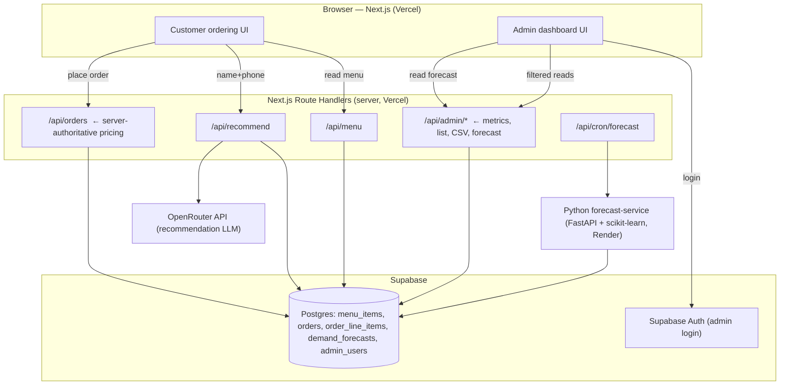

# SliceMatic — PizzaFlow Stage 3

A production full-stack pizza-ordering system for **SliceMatic**, a single-outlet delivery
brand in New Ashok Nagar, Delhi. Customers order through a guided web flow with an **AI pizza
recommendation**; the owner gets an authenticated **analytics dashboard** with revenue, top
pizza, busiest hour, CSV export, and a **7-day demand forecast** (a second, scikit-learn AI
feature).

> **Stack:** Next.js 16 (App Router) · React 19 · Supabase (Postgres + Auth) · OpenRouter
> (`:free` LLM) · Python + FastAPI + scikit-learn · Vercel. Money is integer **paise**; all
> pricing is **server-authoritative**.

## Live links

| What | URL |
|---|---|
| Web app (Vercel) | _<add after deploy>_ |
| Supabase project (read-only for grader) | _<add after deploy>_ |
| Forecast service (Render) | _<optional — add if deployed>_ |

---

## Architecture



**Key decisions**

- **Server-authoritative money math.** The browser never computes or sends prices. `/api/orders`
  re-reads item prices from `menu_items` by code and recomputes the bill with the single pricer
  (`web/lib/pricing.ts`). This prevents tampering and makes the live "change the discount
  threshold" demo a one-line, one-place edit.
- **Two Supabase clients, strict key separation.** The browser uses the **anon/publishable** key
  (public menu read only, guarded by RLS). All writes and admin reads go through server route
  handlers using the **service-role** key, never exposed to the client.
- **OpenRouter is server-side only.** The key is a non-`NEXT_PUBLIC_` env var; the LLM call
  happens in `/api/recommend`, never from the browser.
- **Forecasting is a separate Python service** (scikit-learn is Python-only). It reads order
  history from Supabase, trains, and writes predictions into `demand_forecasts`. The Next.js app
  only reads that table — **no Python at request time**.

**Repo layout**

```
web/                 Next.js app (App Router, routes, lib, components, tests)
forecast-service/    Python FastAPI + scikit-learn demand forecaster (Feature C)
supabase/            SQL migrations (schema, RLS, RPCs, rate-limit) + config
docs/                SECURITY.md (audit), DEMO.md (Q&A prep)
render.yaml          Render Blueprint for the forecast service
Types_of_*.txt       Menu seed source (parsed at runtime, swap-safe)
```

---

## Setup (local)

Prerequisites: Node 24 LTS, Python 3.12, Supabase CLI (`npx supabase`), a Supabase project, an
OpenRouter API key.

**1. Environment.** Copy `web/.env.example` → `web/.env.local` and fill it (all git-ignored):

| Var | Where | Notes |
|---|---|---|
| `NEXT_PUBLIC_SUPABASE_URL` | browser + server | bare project URL |
| `NEXT_PUBLIC_SUPABASE_PUBLISHABLE_KEY` | browser | anon/publishable key (RLS-guarded) |
| `SUPABASE_SECRET_KEY` | server only | service-role secret (bypasses RLS) |
| `NEXT_PUBLIC_APP_URL` | build/runtime | public app URL |
| `OPENROUTER_API_KEY` | server only | Feature A (optional; cold-start works without it) |
| `OPENROUTER_MODEL` / `OPENROUTER_FALLBACK_MODEL` | server | `:free` slugs (defaults provided) |
| `FORECAST_SERVICE_URL` / `FORECAST_SERVICE_TOKEN` | server | Feature C trigger (optional) |
| `CRON_SECRET` | server | guards `POST /api/cron/forecast` |

**2. Database + seed.**

```bash
cd web
npx supabase db push        # apply migrations 0001–0005 (schema, RLS, RPCs, rate-limit, grants)
npm run seed:menu           # parse the three Types_of_*.txt files → menu_items (swap-safe)
npm run seed:orders         # ~75 days of synthetic history for the forecast (phone prefix 9990)
npm run provision:admin     # create the admin auth user (ADMIN_EMAIL/ADMIN_PASSWORD in .env.local)
```

**3. Run.**

```bash
cd web && npm install && npm run dev          # http://localhost:3000
```

**4. Forecast service (optional, for live retrain).** See `forecast-service/README.md`:

```bash
cd forecast-service && python -m venv .venv && . .venv/Scripts/activate
pip install -r requirements.txt
cp .env.example .env    # SUPABASE_URL, SUPABASE_SERVICE_KEY, FORECAST_SERVICE_TOKEN
uvicorn app:app --port 8000
curl -X POST localhost:8000/train -H "x-forecast-token: <token>"   # populates demand_forecasts
```

---

## Deploy

- **Supabase:** create project → `supabase db push` → `seed:menu` + `seed:orders` →
  `provision:admin` → share **read-only** access with the grader.
- **Vercel (web):** import the repo with **Root Directory `web/`** → set all env vars from the
  table above → deploy. `web/vercel.json` registers the daily cron. Confirm the public URL loads
  the full flow, `/api/health` and `/api/ready` return 200.
- **Forecast service (Render, optional):** deploy via the `render.yaml` Blueprint (or a manual Web
  Service rooted at `forecast-service/`, start `uvicorn app:app --host 0.0.0.0 --port $PORT`), set
  the three env vars, hit `/train` once, then set `FORECAST_SERVICE_URL` in Vercel.
- **Cron:** `web/vercel.json` runs `POST /api/cron/forecast` daily at 02:00 UTC. Vercel sends
  `Authorization: Bearer $CRON_SECRET`; the route verifies it with a constant-time compare.

---

## AI features

### Feature A — Recommendation engine (`/api/recommend`)

After name + phone intake, the app suggests one pizza + one topping with a one-line reason,
before the menu step. **UX value:** faster ordering and a personalised touch; returning customers
get a pick informed by their history, new customers get a framed popular pick — and ordering is
**never blocked** if the model fails.

- **Returning customers** (have history) → the LLM is called via OpenRouter with the system prompt
  below + the live menu + a compact history summary. The returned codes are **menu-validated**.
- **Cold start / no key / any failure** → a **deterministic** pick (most-ordered available pizza +
  topping, or the priciest as a house favourite when there's no data). No LLM call.
- Guardrails: server-side key only, 4s timeout, **defensive JSON parsing** (free models don't
  reliably honour strict `json_schema`), 429/timeout **rotation to the fallback `:free` model**,
  and menu-validation before use. `AI_UNAVAILABLE` is returned as **HTTP 200** with a fallback so
  the client always has a pick. Per-IP rate limited (10/60s). Code: `web/lib/openrouter.ts`,
  `web/lib/recommend.ts`, `web/app/api/recommend/route.ts`.

**Model choice + rationale.** Primary `meta-llama/llama-3.2-3b-instruct:free`, fallback
`meta-llama/llama-3.3-70b-instruct:free` — both on OpenRouter's **free tier** (`:free` → $0). A
small/fast model is chosen for **low latency** on the live ordering path; the 70B is a reliable
heavier fallback when the primary is throttled. **Deviation from the PRD:** the PRD's primary
`meta-llama/llama-4-scout:free` was **discontinued** as a free endpoint (404 "unavailable for
free"), so it was swapped for the two live `:free` slugs above. The `:free` suffix is mandatory
(the non-suffixed slug bills credits); re-verify both slugs on `openrouter.ai/models` before a
demo, as the free roster rotates.

**System prompt (verbatim):**

```
You are SliceMatic's pizza recommendation assistant.

You are given:
1. MENU — the CURRENTLY AVAILABLE items as JSON, grouped into pizzas and toppings,
   each with a "code" and "name".
2. HISTORY — the customer's past orders as JSON (may be empty).

Task: recommend EXACTLY ONE pizza and ONE topping, chosen ONLY from the provided
MENU, that best fit the customer's demonstrated preferences. If HISTORY is empty,
recommend a widely popular combination and frame it as a popular pick.

Rules:
- Never suggest an item whose code is not present in MENU.
- "reason" must be ONE friendly sentence, under 20 words, no emojis.
- Respond with ONLY a JSON object matching the schema. No text before or after.

Output schema:
{ "pizza_code": string, "topping_code": string, "reason": string }
```

### Feature C — Demand forecasting (bonus, `/api/admin/forecast`)

A separate Python service predicts order volume per hour for the **next 7 days**, so the owner can
staff riders and pre-prep for peaks. The dashboard shows a bar chart of average predicted orders
per hour, the **top-3 predicted peak hours**, and the model + RMSE.

- **Pipeline** (`forecast-service/model.py`): read `orders.placed_at` → bucket per (IST date,
  hour) over operating hours **11:00–23:00** with zero-fill → features `hour_of_day`,
  `day_of_week`, `is_weekend`, `lag_1d`, `lag_7d` → **temporal train/test split** (last ~20% of
  *dates*, never random → no leakage) → **RandomForestRegressor** with a **LinearRegression
  baseline**, RMSE reported for both → predict next 7 days × hours → upsert `demand_forecasts`.
- **Model stored:** RandomForest (`model_version = rf-v1`); the linear model is a reported baseline.
- **RMSE ≈ 2.1 orders/hr** on the synthetic seed (RF 2.09 vs Linear 2.00). Honest note: hourly
  counts are sparse and the synthetic curve is smooth, so RF ≈ Linear here and forecasts are
  **directional**, not precise — production accuracy needs several weeks of real orders (cold-start
  is seeded with synthetic history, tagged with phone prefix `9990` and **excluded** from revenue
  and popularity so the customer-facing numbers stay honest).
- **No Python at request time:** the service (triggered by the daily cron) writes the table; the
  dashboard reads it via `/api/admin/forecast`.

---

## API reference

All routes return the standard envelope, except `GET /api/admin/export` (raw CSV):

```jsonc
{ "success": true, "data": { /* ... */ } }                       // success
{ "success": true, "data": [ ... ], "pagination": { total, page, limit, totalPages } }  // paginated
{ "success": false, "error": { "code": "VALIDATION_ERROR", "message": "…", "fields": { … } } }  // error
```

**Error codes → HTTP:** `VALIDATION_ERROR` 400 · `UNAUTHENTICATED` 401 · `FORBIDDEN` 403 ·
`CONFLICT` 409 · `MENU_ITEM_NOT_FOUND` 422 · `RATE_LIMITED` 429 · `AI_UNAVAILABLE` 200/503 ·
`INTERNAL` 500.

### `GET /api/menu` — public
Live available menu, grouped. **Response:** `{ bases[], pizzas[], toppings[] }`, each item
`{ id, code, name, pricePaise }`. Read via the anon client so RLS returns available items only.

### `POST /api/recommend` — public (rate-limited 10/60s)
**Body:** `{ phone }` (10 digits, starts 6–9). **Response 200:**
`{ recommendation: { pizzaCode, toppingCode, pizzaName, toppingName, reason } }`.
**Errors:** 400 `VALIDATION_ERROR` (bad phone), 429 `RATE_LIMITED`; on any model failure it still
returns 200 with a deterministic pick (`AI_UNAVAILABLE` is 200). Server-side key; never blocks ordering.

### `POST /api/orders` — public (rate-limited 10/60s)
Create an order; the server recomputes the bill from DB prices and persists it atomically.
**Headers:** `Idempotency-Key: <uuid>` (a replay → 409). **Body:**
`{ name, phone, sessionStartedAt?, paymentMode: 'Cash'|'Card'|'UPI', lineItems: [{ baseCode, pizzaCode, toppingCode }] }`
(1–10 items). **Response 201:** `{ order, bill }` — `bill` priced server-side (unit = base+pizza+
topping → 10% discount at qty ≥ 5 → 18% GST on the discounted total). **Errors:** 400
`VALIDATION_ERROR` (fields) · 422 `MENU_ITEM_NOT_FOUND` · 409 `CONFLICT` · 429 `RATE_LIMITED` ·
500 `INTERNAL` (order rolled back atomically). Client prices are ignored; `computeBill()` is the
only pricer. Body capped at ~10 kB.

_Example:_
```bash
curl -X POST /api/orders -H 'content-type: application/json' -H 'Idempotency-Key: <uuid>' \
  -d '{"name":"Isha","phone":"9812345678","paymentMode":"UPI",
       "lineItems":[{"baseCode":"B3","pizzaCode":"P7","toppingCode":"T1"}]}'
```

### `GET /api/admin/orders` — admin (Supabase session + `is_admin()`)
Paginated order list with line items. **Query:** `from`, `to` (ISO), `payment`, `page`, `limit`
(≤100). **Response:** paginated envelope of orders (+ `order_line_items`). Synthetic seed orders
are excluded. **Errors:** 401 `UNAUTHENTICATED`, 403 `FORBIDDEN`.

### `GET /api/admin/metrics` — admin
**Query:** `from`, `to`, `payment`. **Response:**
`{ revenuePaise, topPizza: {name,count}|null, busiestHour: {hour,count}|null, orderCount }`
(IST). Synthetic orders excluded.

### `GET /api/admin/export` — admin
**Query:** `from`, `to`, `payment`. **Response:** `text/csv` attachment (RFC-4180 + formula-
injection guard). Not the JSON envelope.

### `GET /api/admin/forecast` — admin
Latest forecast run. **Response:**
`{ generatedAt, model, rmse, points: [{date,hour,predicted}], top3PeakHours: [{hour,avgPredicted}] }`.
Reads `demand_forecasts` (no Python at request time).

### `POST /api/cron/forecast` — cron secret
Triggers the forecast service `/train`. **Auth:** `Authorization: Bearer <CRON_SECRET>` (Vercel
Cron) or `x-cron-secret: <CRON_SECRET>` (manual), constant-time compare. **Response 200:** the
training summary `{ model, rfRmse, linRmse, rowsWritten, generatedAt }`. **Errors:** 401, 500.

### `GET /api/health` — public
Liveness. **Response:** `{ status: "ok" }` (no DB call).

### `GET /api/ready` — public
Readiness: a short Supabase Auth health check. 200 when reachable, else **503**.

---

## Testing & CI

- **web:** Vitest + Testing Library. `npm test` runs the unit + component suite (103 tests). Opt-in
  live-DB integration suites (need `.env.local`): `npm run test:integration | test:rls |
  test:recommend | test:admin | test:forecast`. E2E is covered by the RTL happy-path (the Stepper
  test walks all 7 order steps) plus the integration suites; a dedicated Playwright layer was
  intentionally not added.
- **forecast-service:** `pytest` (DB-free model tests — bucketing, zero-fill, leak-free split, RMSE).
- **CI** (`.github/workflows/ci.yml`, on every push/PR to `main`): a `web` job
  (`npm ci → tsc --noEmit → lint → test → next build → npm audit --audit-level=high`) and a
  `forecast` job (Python 3.12 → `pytest`).

## Security

See **[`docs/SECURITY.md`](docs/SECURITY.md)** for the full checklist audit. Highlights: server-only
service-role + OpenRouter keys, RLS on all tables with `is_admin()`, server-authoritative pricing,
Zod re-validation on every route, durable rate limits, 10 kB body cap, CSV formula-injection guard,
LLM output menu-validation, cron-secret + service-token guards, Zod env crash-on-misconfig, and no
secrets/PII in logs.

## Rubric map

| Component | Pts | Delivered by |
|---|---:|---|
| Vercel frontend — live, responsive, full flow | 10 | `web/` (customer stepper, design system) |
| Supabase DB — 3+ tables, orders saved, menu from DB, dashboard | 12 | `supabase/`, `/api/*`, admin |
| Auth + admin dashboard — login, filters, revenue, CSV | 8 | `/admin`, `/api/admin/*` |
| AI feature — OpenRouter, system prompt, real UX value | 12 | Feature A (above) |
| Live demo + Q&A | 8 | see `docs/DEMO.md` |
| ★ Bonus — second AI feature, documented | +10 | Feature C (above) |

See also **[`docs/DEMO.md`](docs/DEMO.md)** for the demo script and Q&A prep.
